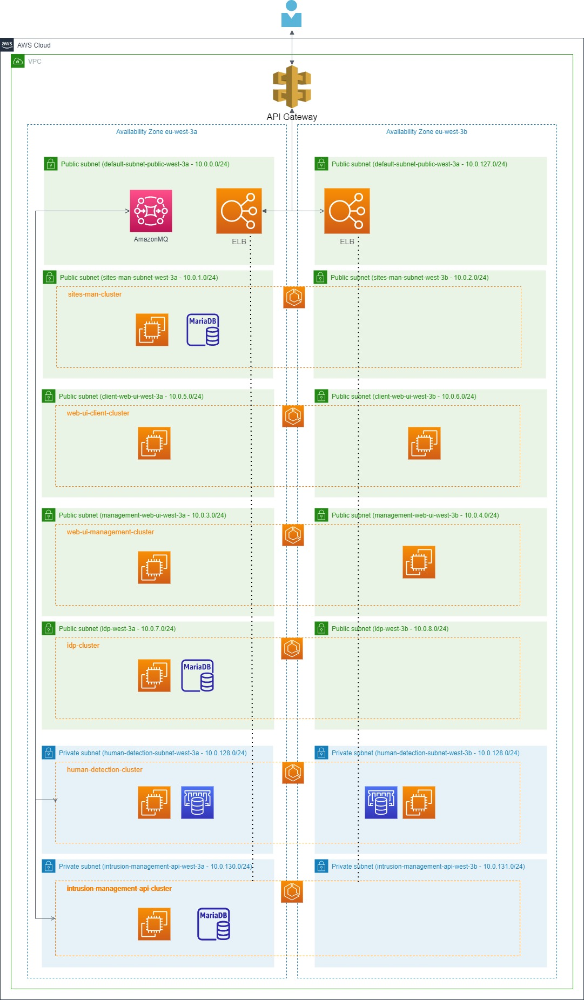
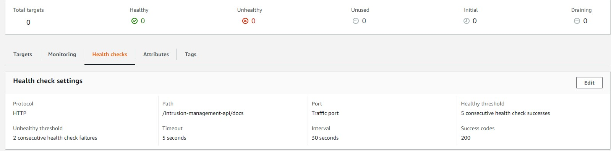
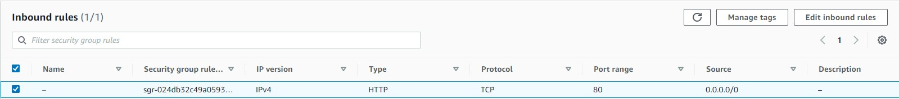
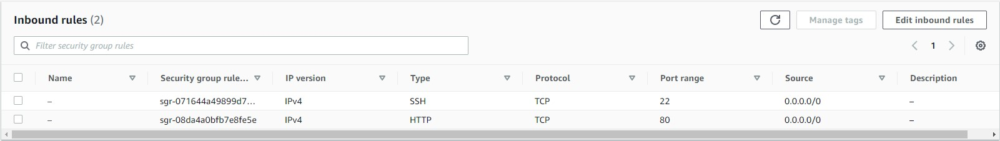
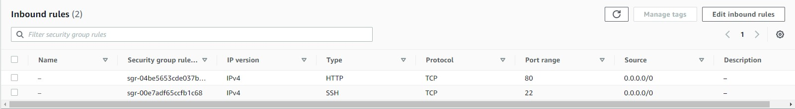
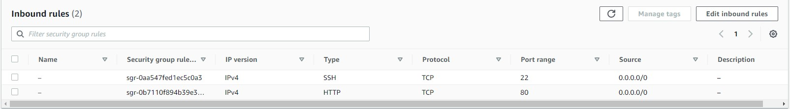

# AWS cloud architecture

## VPC structure

Our VPC is available in 2 availability zones (eu-west-3a and eu-west-3b), providing high availability for our services. Each service has 2 dedicated subnets, one for each availability zone.
There are one additional pair of subnets (default-subnet-public) that is used for general AWS services (e.g elastic load balancer (ELB)).

Even though we have 2 "private" subnets they are not truly private since they are given a dynamic public IP and that they route outside traffic to the internet gateway, i.e. private subnets share the routing table with public subnets. We were forced to make this decision since the AWS free tier doesn't provide NAT gateways for free.

> **NOTE:**
In the case of the intrusion management API and sites management API because they rely on a local database container we are limited to a single EC2 instance, even though does services are deployed in a scalable cluster. This can be solved be using a service like RDS (relational database service) that provides higher availability. We intend to migrate to this alternative in the future.

### Routing

Since each EC2 is given a random public IP address and that elastic IP address service is not available in the free tier, the routing is handled by the ELB together with the API Gateway. When a service or a client issues a request to the API Gateway it's forwarded to the ELB that is responsible to route it to the appropriate place.

## API Gateway + Elastic load balancer

The API Gateway is responsible to map all the service and user's requests to the corresponding service request. The resulting request is then forwarded to the ELB and delivered to the right EC2 instance group.

The ELB listens for HTTP requests delivered by the gateway and then chooses the appropriate service (target group) based on the URL.

To determine which EC2 instance is active at a given time, and therefore capable to handle the request, a period health check is performed. Requests are then only forwarded to active instances.

## Security groups

Each service has its security group allowing inbound traffic according to the service protocols and ports that it uses. For simplicity, all outbound traffic is allowed. In the future, a more elaborate set of rules outbound must be applied.

>**NOTE:**
For the inbound ssh traffic, we allow every ipv4 address to open ssh session from the outside. This is possible since all networks are connected to the internet gateway as explained in [VPC structure](#VPC-structure). Despite simple, is not the optimal solution. In a real scenario the private subnets would not be accessible from the outside nor would we want to allow ssh traffic from the internet. The correct solution would be to place a static bastion server in a public subnet that allows ssh from specific machines, all other instances would allow ssh only from the bastion.

### Human detection service (human-detection-security-group)

### Intrusion management API (intrusion-management-api-security-group)

### Load balancer (lb-security-group)

### Sites management API (sites-man-security-group)

### Web UI client (web-ui-client-security-group)

### Web UI management (web-ui-management-security-group)

### IDP (idp-security-group)

## Service deployment

Every service is deployed using the elastic container service (ECS). This allows us to scale our services up and down at any time and to easily shut them down when they are not in use. The deployment workflow is automated using github actions.

After passing the code validation tests the updated services can be deployed by committing to the main branch or by triggering the corresponding workflows manually. 

The deployment process performs the following steps:

- Log in to the AWS account using the secrets in us-east-1 region.
- Build the container and push it public elastic container registry (ECR).
- Change region to eu-west-3.
- Update cluster service task to point to the newly created container image and insert relevant environment variables.
- Finally, upload the previously updated task to AWS.

At the of the process, the corresponding service is updated.

**NOTE:**
We are using the public ECR do to the 500MB limitation for the private registry. We have to first login into us-east-1 to access the public registry and then change to eu-west-3, our VPC region.