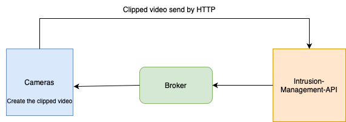

# Cliping an intrusion

When a intrusion occours, the intrusion-management-api, send a message to the broker, where the cameras are subscribed. 
The timestamp of the intrusion is received and the camera start to make a clip of the intrusion with a duration of 10 seconds before and 10 seconds after the intrusion, so the user can see the context of the intrusion.

The clip is saved and then, is send to the intrusion-management-api where will be stored in a S3 bucket, on AWS.

The following image shows the cliping process:

