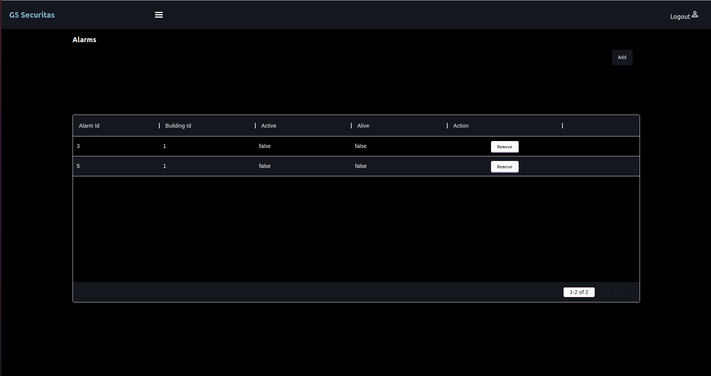
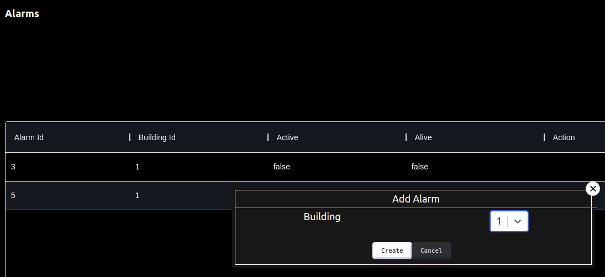
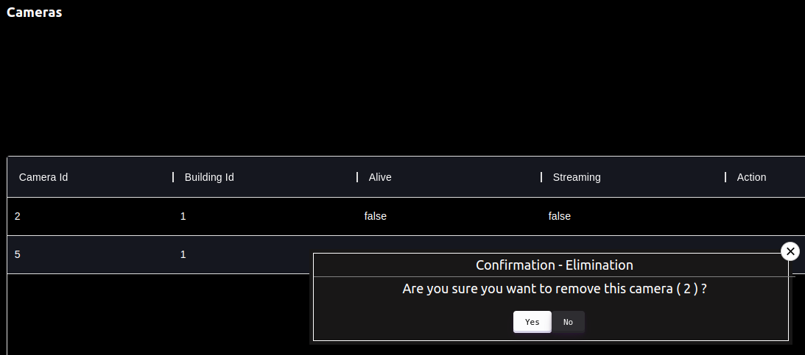
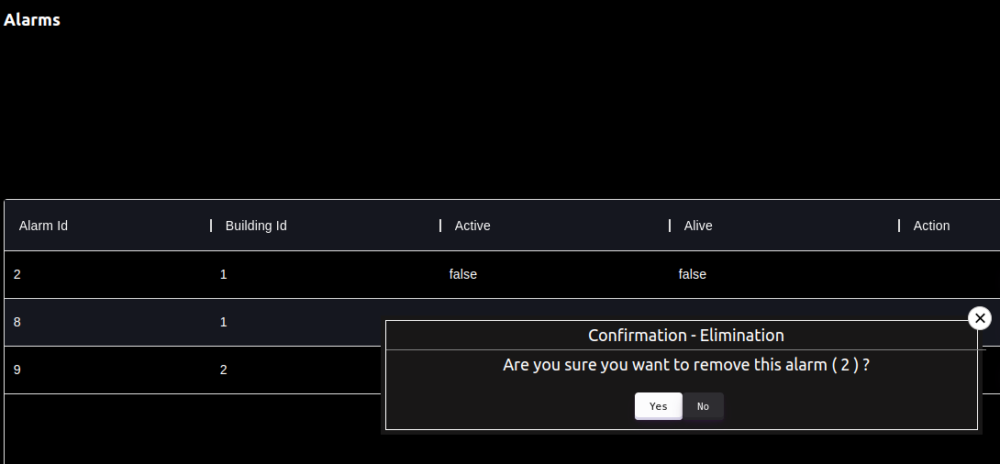

# Front-end

The [React](https://reactjs.org/) was the tool chosen to develop the Client Web UI.

## Cameras and Alarms Page

First, we created two pages, one to list the cameras and the other to list the alarms, for a given client, so that the client can see their characteristics.
For this, we implemented a “Cameras” component and another “Alarms” component. In each component we developed a code from a table, which contains information about the cameras/alarms.

We perform the functionality of adding and removing a camera on the cameras page, and on the alarms page we implement the functionality of adding and removing an alarm.

On the cameras page, we developed a button at the top of the page with the label "Add". We create a Popup, which appears when we click on the "Add" button, with a form suitable for creating a camera.

On the alarms page we did the same thing for the alarms.

On the cameras page, in each row of the camera table (in each camera) we create a "Delete" button, and a Popup associated with the button that works as confirmation of the camera's deletion.

We did the same for the alarms page. 

## Intrusions page

We also created a page to list the instructions for a specific client.
We implemented an "Intrusions" component with code for a table with information about the intrusions (date, time, property and the camera ID where the intrusion occurred).

In addition, we have developed the functionality to view the intrusion video. We created a "Watch Video" button in each line of the table (in each intrusion), and a Popup associated with the button that shows the respective intrusion video.