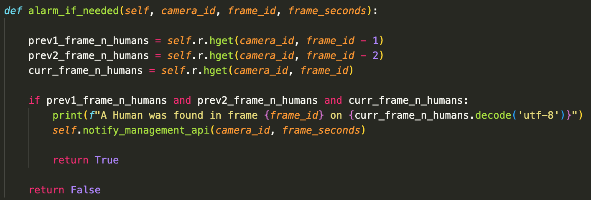

# Introduction 

This module is where all the image processing is done. The main function of HDM is to process each video frame sent by the `cameras` and detect if there is an intrusion.

When the HDM detects a human in 3 consecutive frames, a notification is sent to the Intrusion Management API. 

Each frame with an intrusion is saved in the Amazon Elastic Cache. Then, as it is shown above, the module checks if the previous frames also had an intrusion and notifies the Intrusion Management API, if needed.

