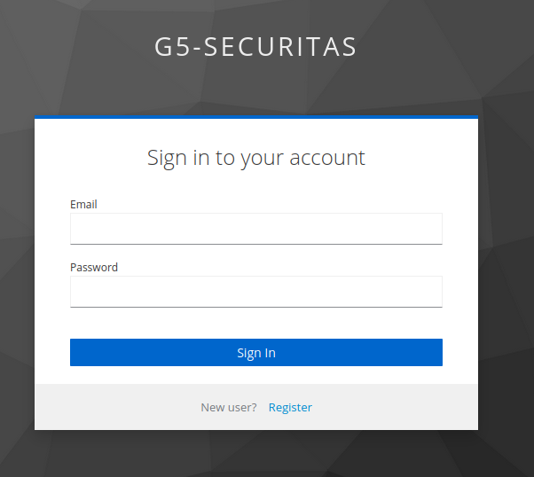

# Identity Provider

## Introduction


The IDP will be used to provide authentication and authorization mechanisms for all the API's and UI's.
The chosen technology for IDP was [Keycloak](https://www.keycloak.org/).


## Keycloak Configuration

### Realm

The first step was to create a realm for our project, "g5-securitas", it is in this realm where the users will be registred, the settings for such users will be configured and where users managements. 

### Roles

Next, we created 2 roles for the realm in question, one for management users and another for client users, respectively "g5-admin" and "g5-end-users". By default all users registred using the IDP will get the role "g5-end-users".

The management users are configured by the keycloak admin client, where credentials and the "g5-admin" role are assigned, in order to be able to authenticate in the Management UI.

### Clients

Clients are applications, in our case API's and UI's that can request the authentication of a certain user. Each of the UI's and API's has it's own client configuration that allows authenticate to users, these clients use their client Id and a server generated Secret, for authentication against the Keycloak Server 

So finally, we created 3 clients, one for the Managment Web UI, another for the Client Web UI, for the Sites Managment API and Itrusion Management API, although it's methods were not set up for authentication.


## Frontend integration with IDP
In order to integrate the IDP in the frontends we had to install the following dependencies:
```
npm i keycloak-js
npm i @react-keycloak/web
```
We create a Keycloak.js file, where we create a Keycloak instance with the Keycloak server URL, with the realm name and the respective frontend ID.
```javascript
import Keycloak from "keycloak-js";
const keycloak = new Keycloak({
 url: process.env.REACT_APP_KEYCLOAK_URL,
 realm: process.env.REACT_APP_REALM,
 clientId: process.env.REACT_APP_CLIENT_UI_ID,
});

export default keycloak; 
```

In the index.js file, we import the < ReactKeycloakProvider /> with the keycloak.js file as a prop. Wraps the entire app with the identity provider
```javascript
import React from 'react';
import ReactDOM from 'react-dom/client';
import './index.css';
import App from './App';
import reportWebVitals from './reportWebVitals';
import { ReactKeycloakProvider } from "@react-keycloak/web";
import keycloak from "./Keycloak";

const root = ReactDOM.createRoot(document.getElementById('root'));
root.render(
   <ReactKeycloakProvider authClient={keycloak}>
    <App />
   </ReactKeycloakProvider>
);

reportWebVitals();
```

In both frontends, in the Sidebar we define that the Home page is a public page and the rest are private pages, that is, the Home page can be accessed without authentication, but the rest can only be accessed with authentication.

We implemented code in the frontends that checks if there is an authenticated user, if there is it shows a Logout button and the name of the authenticated user, if not it shows the Login button. When the Login button is clicked, Keycloak's Login method is executed to authenticate the user. When the Logout button is clicked, Keycloak's Logout method is executed to Logout of the user's account.



In the frontends, in each call to the Sites Management API we add the 'Authorization' header with the authenticated user token.

## API integration with IDP

API authentication and authorization were implemented in our API's using the fastapi_keycloak library, as fastapi was our chosen technology for
APIs. 


For the API clients it was enabled both client authentication and authorization mechanisms. In terms of OpenID Connect, these clients, have the Authorization Code Flow enabled, which requires the user to first get an access token from the Keycloak server, and then add this token to the Authorization Header of all the requests to the API protected endpoints. 


With the IDP integration, none of the APIs store any of the system's users information apart from his ID and property address.

