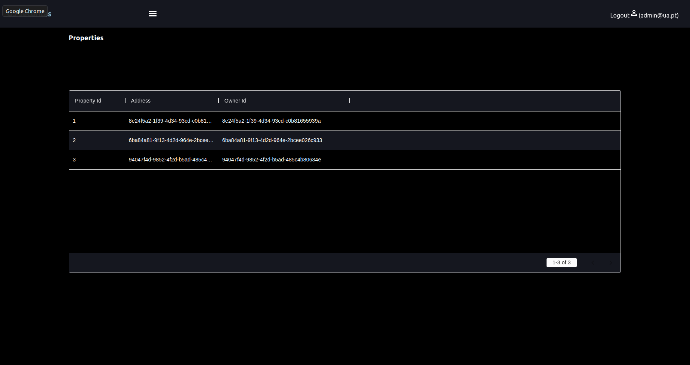
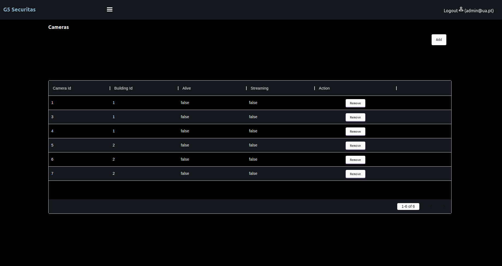
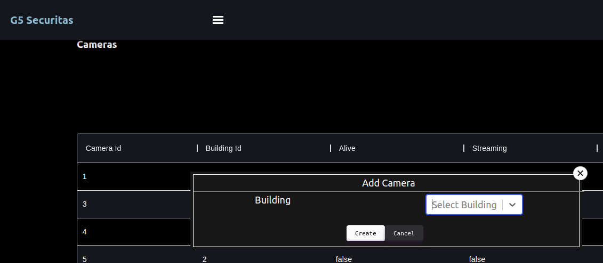

# Front-end

The [React](https://reactjs.org/) was the tool chosen to develop the Management Web UI.

## Users and Properties Page

First we create a page to list all users, and another page to list all properties so that the admin can see all users/properties on the system.
For this, we implemented a "Users" component, and a "Properties" component where we developed code from a table, which contains information about all users/properties.

## Cameras and Alarms Page

We created two pages, one to list the cameras and the other to list the alarms.
For this, we implemented a “Cameras” component and another “Alarms” component. In each component we developed a code from a table, which contains information about the cameras/alarms.

We perform the functionality of adding and removing a camera on the cameras page, and on the alarms page we implement the functionality of adding and removing an alarm.

On the cameras page, we developed a button at the top of the page with the label "Add". We create a Popup, which appears when we click on the "Add" button, with a form suitable for creating a camera.

On the alarms page we did the same thing for the alarms.

On the cameras page, in each row of the camera table (in each camera) we create a "Delete" button, and a Popup associated with the button that works as confirmation of the camera's deletion.

We did the same for the alarms page. 
