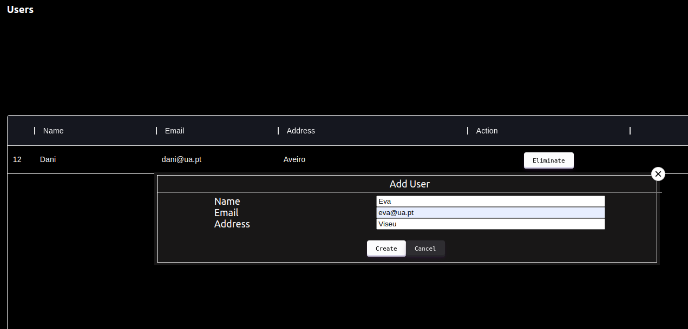
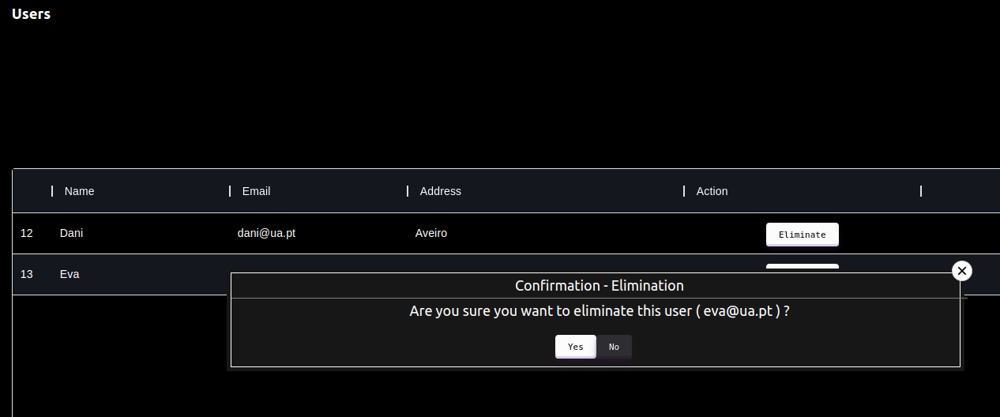

# Management Web UI

The [React](https://reactjs.org/) was the tool chosen to develop the Management Web UI.

First we create a page to list all users so that the admin can see all users on the system.
For this, we implement a "Users" component, where we develop code from a table, which contains information from all users .

Still in the component created earlier, "Users", we perform the functionality of adding and removing a user.
We implemented a button at the top of the page with the label "Add". We create a Popup, which appears when we click on the "Add" button, with a suitable form for creating a user.  

In each row of the users table (in each user) we create an "Eliminate" button, and a Popup associated with the button that works as confirmation of the user's elimination. 
